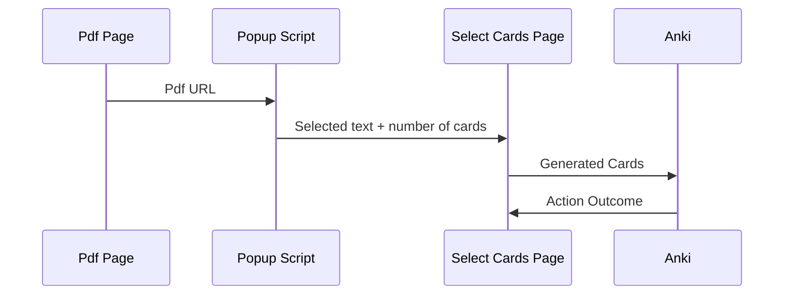

# anki-everything

tiny project to anki pdfs and webpages. uses anki connect and o3 to generate high quality flashcards.

## roadmap

- [ ]: improved card selection ui (main feature is text editing cards)
- [ ]: price estimation
- [ ]: webpage support
- [ ]: clean up the mess that is types.ts
- [ ]: error handling
- [ ]: vision support
- [ ]: add a linter

## dev instructions

```
npm install
npm run dev
```
 
then load the manifest.json in the dist directory to chrome in devloper mode

## system spec



The extension injects a content script into the page at run time. When the popup is clicked, it requests the URL of the current page from the content script and uses this URL to download the pdf locally for text parsing (This seems uneeded, I should just be able to get the url via the api, but never got it to work). We then send the selected text and number of cards to the select cards extension page. (TODO: formalize this request as a type)

The select cards page sends the text + system prompt to the openai api. (Note: I would/want to replace this with openrouter, but o3 isn't on there and its just too good a model). It receives a list of card strings as a structured output response, which it displays for you to select/reject for uploading to anki via anki connect. 